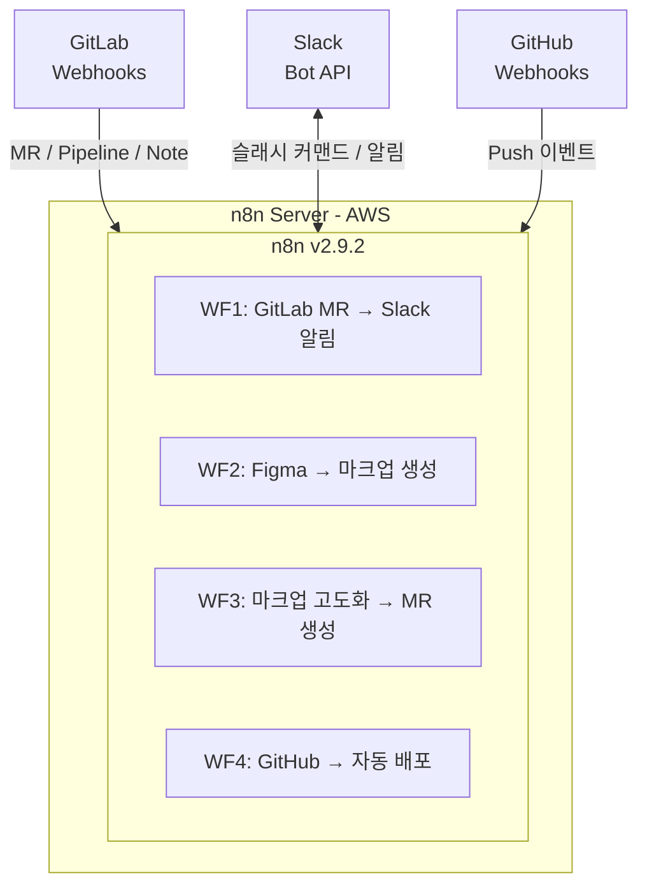
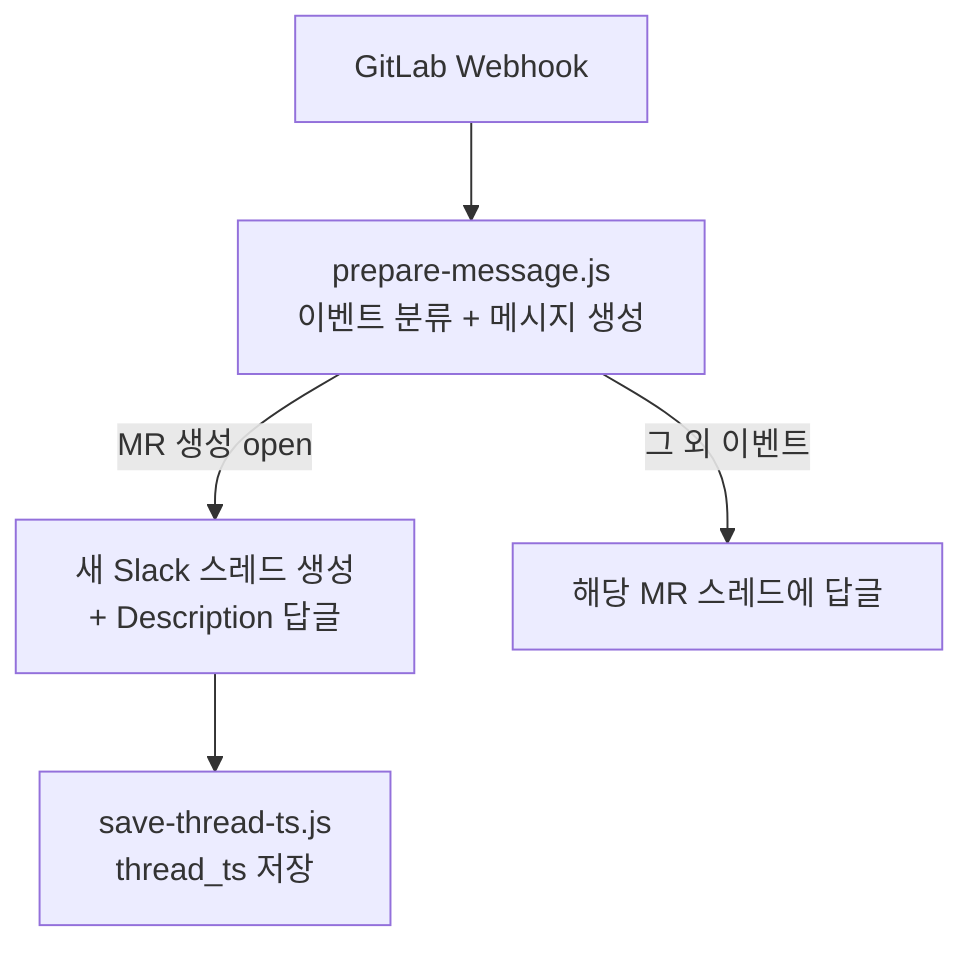
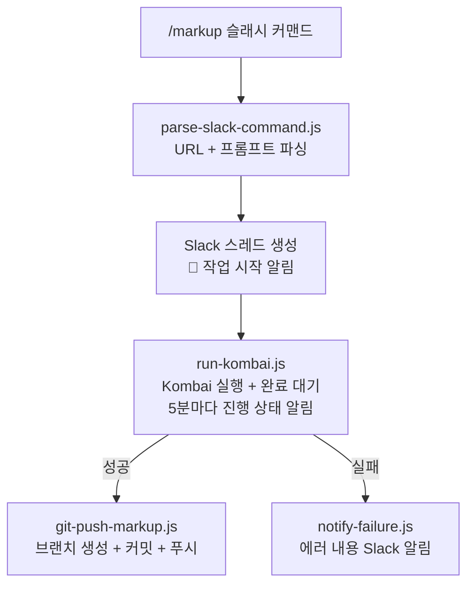
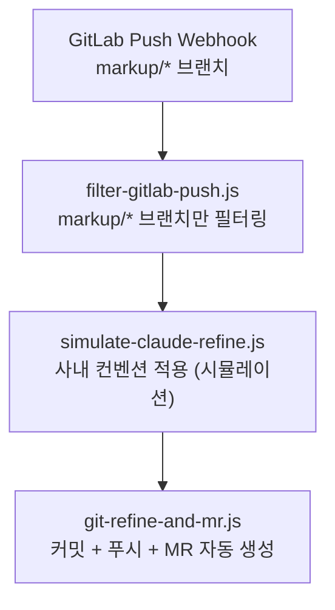
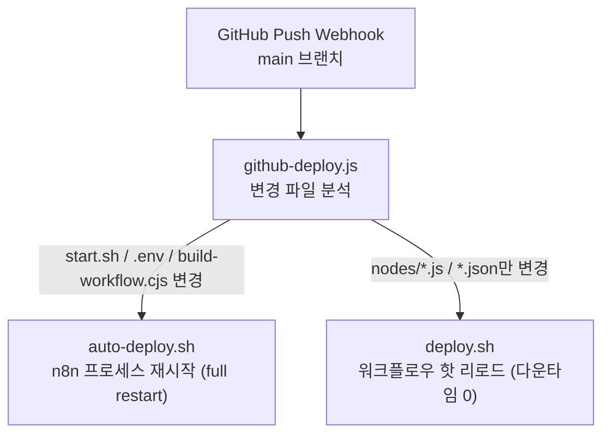
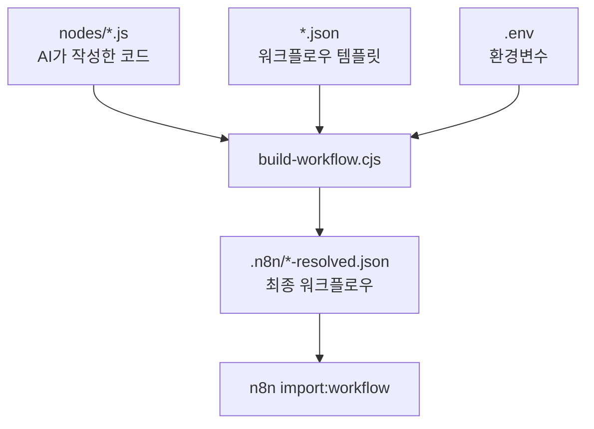

# n8n 기반 프론트엔드 개발 자동화

> AI로 워크플로우를 작성하고, 코드처럼 관리하는 자동화 시스템을 소개합니다.

---

## 목차

- [n8n 기반 프론트엔드 개발 자동화](#n8n-기반-프론트엔드-개발-자동화)
  - [목차](#목차)
  - [핵심 컨셉: AI가 워크플로우를 작성한다](#핵심-컨셉-ai가-워크플로우를-작성한다)
    - [일반적인 n8n 사용 방식](#일반적인-n8n-사용-방식)
    - [우리의 접근: AI-First 워크플로우 개발](#우리의-접근-ai-first-워크플로우-개발)
  - [왜 n8n인가?](#왜-n8n인가)
    - [기존 문제](#기존-문제)
    - [n8n을 선택한 이유](#n8n을-선택한-이유)
  - [시스템 개요](#시스템-개요)
    - [전체 아키텍처](#전체-아키텍처)
    - [4개 워크플로우 요약](#4개-워크플로우-요약)
  - [워크플로우 1: GitLab MR → Slack 알림](#워크플로우-1-gitlab-mr--slack-알림)
    - [동작 흐름](#동작-흐름)
    - [지원하는 이벤트](#지원하는-이벤트)
    - [핵심 구현 포인트](#핵심-구현-포인트)
  - [워크플로우 2: Figma → 마크업 자동 생성](#워크플로우-2-figma--마크업-자동-생성)
    - [동작 흐름](#동작-흐름-1)
    - [사용 예시](#사용-예시)
    - [핵심 구현 포인트](#핵심-구현-포인트-1)
  - [워크플로우 3: 마크업 고도화 → MR 생성](#워크플로우-3-마크업-고도화--mr-생성)
    - [동작 흐름](#동작-흐름-2)
    - [MR 자동 생성: `git push -o` 활용](#mr-자동-생성-git-push--o-활용)
    - [향후 계획](#향후-계획)
  - [워크플로우 4: GitHub Push → 자동 배포](#워크플로우-4-github-push--자동-배포)
    - [동작 흐름](#동작-흐름-3)
    - [핵심: 핫 리로드 vs 풀 재시작](#핵심-핫-리로드-vs-풀-재시작)
  - [빌드 시스템: AI 개발을 가능하게 하는 구조](#빌드-시스템-ai-개발을-가능하게-하는-구조)
    - [왜 분리했나?](#왜-분리했나)
    - [해결: 템플릿 빌드 방식](#해결-템플릿-빌드-방식)
  - [도입 효과 \& 향후 계획](#도입-효과--향후-계획)
    - [정량적 효과](#정량적-효과)
    - [향후 계획](#향후-계획-1)
  - [Q\&A](#qa)
    - [세팅하고 싶다면?](#세팅하고-싶다면)
    - [참고 자료](#참고-자료)

---

## 핵심 컨셉: AI가 워크플로우를 작성한다

> **이 프로젝트의 본질은 "자동화 워크플로우 자체를 AI와 함께 만든다"는 것입니다.**

### 일반적인 n8n 사용 방식

```
사람이 n8n UI에서 드래그 & 드롭으로 워크플로우 구성
  → Code 노드에 로직 직접 작성
  → UI에서 테스트 & 배포
```

- UI 기반이라 진입장벽은 낮지만, **복잡한 로직은 결국 코드**
- Code 노드 안의 JavaScript는 n8n UI 에디터에서 작성해야 하는데, **IDE 지원이 없음**
- 워크플로우 JSON 파일은 수천 줄 → 사람이 직접 편집하기 어려움

### 우리의 접근: AI-First 워크플로우 개발

```
AI가 nodes/*.js 코드를 작성
  → build-workflow.cjs가 JSON 템플릿에 자동 주입
  → GitHub push → 자동 배포
```

**AI가 작성 가능한 이유:**

| 설계 원칙                  | 구현                   | AI에게 좋은 이유                     |
| -------------------------- | ---------------------- | ------------------------------------ |
| 코드를 `.js` 파일로 분리   | `nodes/*.js`           | AI가 일반 JS 파일로 읽고 쓸 수 있음  |
| 워크플로우 구조를 템플릿화 | `*.json` 템플릿        | 노드 배치/연결은 한 번만 사람이 설정 |
| 환경변수를 플레이스홀더로  | `SLACK_BOT_TOKEN_HERE` | 민감 정보 없이 코드 공유 가능        |
| 빌드 스크립트로 조합       | `build-workflow.cjs`   | 코드 + 템플릿 + 환경변수 자동 병합   |

**실제 작업 흐름:**

```
1. "GitLab MR 이벤트를 Slack 스레드로 알려주는
    n8n Code 노드를 작성해줘"   ← AI에게 요청

2. AI가 prepare-message.js 작성  ← Slack API, GitLab 페이로드 이해

3. git push                       ← 자동 빌드 + 배포

4. 동작 확인 후 피드백             ← AI가 수정

→ 반복
```

이 구조 덕분에 **n8n을 한 번도 써본 적 없는 개발자도** AI와 대화만으로 워크플로우를 만들 수 있었습니다. 실제로 이 프로젝트의 14개 노드 스크립트 전부가 AI와의 협업으로 작성되었습니다.

---

## 왜 n8n인가?

### 기존 문제

| 문제                                       | 영향                      |
| ------------------------------------------ | ------------------------- |
| MR 생성/머지/파이프라인 결과를 일일이 확인 | 컨텍스트 스위칭 비용 증가 |
| Figma → 코드 변환을 수작업으로 진행        | 반복 작업에 시간 소모     |
| 배포 프로세스가 수동                       | 휴먼 에러 발생 가능성     |

### n8n을 선택한 이유

- **Self-hosted**: 사내 민감한 토큰/코드를 외부로 보내지 않음
- **Webhook 기반**: GitLab, Slack, GitHub 이벤트를 실시간 수신
- **Code 노드 지원**: JavaScript 로직을 자유롭게 작성 가능 → **AI가 코드를 작성할 수 있는 구조**
- **무료 + 오픈소스**: 라이선스 비용 없음
- **가벼움**: 단일 서버로 충분히 운영

---

## 시스템 개요

### 전체 아키텍처



### 4개 워크플로우 요약

| #   | 워크플로우              | 트리거                            | 결과                                    |
| --- | ----------------------- | --------------------------------- | --------------------------------------- |
| 1   | GitLab MR → Slack 알림  | GitLab Webhook (MR/Pipeline/Note) | Slack 스레드에 실시간 알림              |
| 2   | Figma → 마크업 생성     | Slack 슬래시 커맨드 (`/markup`)   | Kombai로 마크업 생성 → GitLab 푸시      |
| 3   | 마크업 고도화 → MR 생성 | GitLab Push Webhook               | Claude 에이전트로 고도화 → MR 자동 생성 |
| 4   | GitHub → 자동 배포      | GitHub Push Webhook               | n8n 워크플로우 핫 리로드 or 재시작      |

---

## 워크플로우 1: GitLab MR → Slack 알림

> **팀 커뮤니케이션의 핵심.** MR의 전체 라이프사이클을 하나의 Slack 스레드로 관리합니다.

### 동작 흐름



### 지원하는 이벤트

| 이벤트          | Slack 메시지                                    | 비고           |
| --------------- | ----------------------------------------------- | -------------- |
| MR 생성         | `@팀명 {제목} MR입니다.` + 작성자/브랜치/레이블 | 새 스레드 생성 |
| MR 업데이트     | 🔄 MR 업데이트 + 변경 필드/커밋                 | 스레드 답글    |
| MR 머지         | ✅ MR 머지 완료                                 | 스레드 답글    |
| MR 닫힘         | 🚫 MR 닫힘                                      | 스레드 답글    |
| MR 재오픈       | ♻️ MR 재오픈                                    | 스레드 답글    |
| MR 승인 / 취소  | 👍 👎                                           | 스레드 답글    |
| 파이프라인 완료 | ✅/❌/🚫 + 링크 + 소요시간                      | 스레드 답글    |
| 코멘트          | 💬 작성자 + 미리보기                            | 스레드 답글    |

### 핵심 구현 포인트

**스레드 관리: `staticData` 활용**

```javascript
const staticData = $getWorkflowStaticData('global')

// MR 생성 시 thread_ts 저장
staticData[`mr_${iid}`] = slackResponse.ts
staticData[`mr_${iid}_channel`] = channelId

// 이후 이벤트에서 thread_ts 조회
const threadTs = staticData[`mr_${iid}`]
```

- n8n의 `staticData`는 워크플로우 실행 간 데이터를 유지하는 내장 저장소
- 별도 DB 없이 MR별 스레드를 추적

**채널 라우팅: 레이블 기반**

```javascript
function getChannel(labels) {
  const names = labels.map((l) => l.title.toLowerCase())
  return names.some((n) => ['ask', 'show'].includes(n))
    ? CHANNEL_DEFAULT // 팀 공유 채널
    : CHANNEL_SHIP // 배포 채널
}
```

- MR 레이블에 `ask`, `show`가 포함되면 팀 채널로, 아니면 배포 채널로 라우팅

**Markdown → Slack mrkdwn 변환**

```javascript
function mdToMrkdwn(md) {
  return md
    .replace(/\*\*(.+?)\*\*/g, '*$1*') // bold
    .replace(/~~(.+?)~~/g, '~$1~') // strike
    .replace(/\[([^\]]+)\]\(([^)]+)\)/g, '<$2|$1>') // link
    .replace(/- \[x\]/gi, '☑') // checkbox
    .replace(/- \[ \]/g, '☐')
}
```

---

## 워크플로우 2: Figma → 마크업 자동 생성

> **Slack에서 `/markup` 커맨드로 Figma 디자인을 React 컴포넌트로 변환합니다.**

### 동작 흐름



### 사용 예시

```
/markup https://www.figma.com/design/xxx/yyy?node-id=123 React + TypeScript + Emotion으로 변환해줘
```

### 핵심 구현 포인트

**Kombai 실행 중 n8n Heartbeat 유지**

```javascript
// 10초마다 await로 이벤트 루프 yield → Task Runner heartbeat 응답 유지
while (!done) {
  if (Date.now() - startTime > TIMEOUT_MS) {
    child.kill('SIGTERM')
    break
  }
  await new Promise((r) => setTimeout(r, 10000)) // ← 핵심!

  // 5분마다 Slack 스레드에 진행 상태 알림
  if (elapsedMin % 5 === 0) {
    postThread(`⏳ Kombai 실행 중... (${elapsedMin}분 경과)`)
  }
}
```

- Kombai는 마크업 생성에 최대 30분 소요
- n8n Code 노드는 장시간 blocking 시 heartbeat 누락으로 강제 종료됨
- 10초 간격 `await setTimeout`으로 이벤트 루프를 yield하여 해결

**취소 기능**

```
/cancel job-1234567890
```

- `staticData`에 작업 상태를 `running`으로 등록
- 주기적으로 취소 여부를 확인(`check-cancel.js`)
- 취소 시 프로세스 종료 + Slack 알림

---

## 워크플로우 3: 마크업 고도화 → MR 생성

> **Kombai가 생성한 마크업을 AI 에이전트로 고도화하고 자동으로 MR을 생성합니다.**

### 동작 흐름



### MR 자동 생성: `git push -o` 활용

```javascript
const pushCmd = [
  'git push',
  '-o merge_request.create', // MR 생성
  `-o merge_request.target=${targetBranch}`, // 타겟 브랜치
  `-o merge_request.title="${mrTitle}"`, // 제목
  '-o merge_request.remove_source_branch', // 머지 후 브랜치 삭제
  `origin ${branchName}`,
].join(' ')
```

- GitLab의 `push option`으로 별도 API 호출 없이 Push와 MR 생성을 한 번에 처리
- 원래 작업 브랜치 보호: stash → 체크아웃 → 작업 → 복원

### 향후 계획

- `simulate-claude-refine.js` → 실제 Claude CLI 에이전트 연동
  - 사내 코딩 컨벤션 자동 적용
  - Emotion styled-components 패턴 변환
  - 접근성(a11y) 개선

---

## 워크플로우 4: GitHub Push → 자동 배포

> **n8n 워크플로우 코드를 GitHub에 푸시하면 자동으로 배포됩니다.**

### 동작 흐름



### 핵심: 핫 리로드 vs 풀 재시작

```javascript
const needsRestart = changedFiles.some((f) => f === 'start.sh' || f === '.env' || f === 'build-workflow.cjs')

if (needsRestart) {
  // n8n 프로세스 자체를 재시작
  execSync(`nohup bash auto-deploy.sh > .n8n/restart.log 2>&1 &`)
} else {
  // 워크플로우 JSON만 재빌드 + import (다운타임 0)
  execSync('bash deploy.sh')
}
```

---

## 빌드 시스템: AI 개발을 가능하게 하는 구조

> 이 빌드 시스템이 **AI-First 워크플로우 개발**의 핵심입니다.
> 코드를 `.js` 파일로 분리했기 때문에 AI가 읽고, 이해하고, 수정할 수 있습니다.

### 왜 분리했나?

| 방식                       | 문제                                 | AI 활용                        |
| -------------------------- | ------------------------------------ | ------------------------------ |
| n8n UI에서 직접 수정       | Git 관리 불가, 재시작 시 유실        | AI가 접근 불가 (GUI 전용)      |
| JSON에 직접 코드 삽입      | JSON 안의 JS 코드는 읽기/편집이 고통 | AI가 JSON 구조까지 알아야 함   |
| **`.js` 파일 분리 (채택)** | **없음**                             | **AI가 일반 JS처럼 작성 가능** |

### 해결: 템플릿 빌드 방식



**빌드 과정:**

1. `.env`에서 환경변수 로드
2. `nodes/*.js` 파일을 읽어서 워크플로우 JSON의 플레이스홀더에 주입
3. 환경변수 치환 (`SLACK_BOT_TOKEN_HERE` → 실제 토큰)
4. `*-resolved.json`으로 출력

**배포 시 `staticData` 보존:**

```bash
# import 전 백업
STATIC_DATA=$(sqlite3 database.sqlite \
  "SELECT staticData FROM workflow_entity WHERE id='$WF_ID';")

# import 후 복원
sqlite3 database.sqlite \
  "UPDATE workflow_entity SET staticData='$STATIC_DATA' WHERE id='$WF_ID';"
```

- `staticData`에는 MR별 `thread_ts`가 저장되어 있음
- import 하면 초기화되므로 SQLite에서 직접 백업/복원

---

## 도입 효과 & 향후 계획

### 정량적 효과

| 항목            | Before           | After                  |
| --------------- | ---------------- | ---------------------- |
| MR 알림 확인    | GitLab 직접 접속 | Slack에서 실시간 수신  |
| Figma → 마크업  | 수작업 (수 시간) | `/markup` 한 줄 (자동) |
| 워크플로우 배포 | SSH 접속 + 수동  | GitHub push (자동)     |
| 운영 비용       | -                | n8n self-hosted (무료) |

### 향후 계획

- [ ] AWS 인프라 이전 (상시 운영 서버)
- [ ] Claude CLI 에이전트 연동 (시뮬레이션 → 실제 고도화)
- [ ] Slack 리액션 연동 (머지 완료 시 `:merge:` 리액션 자동 추가)
- [ ] 테스트 자동화 (마크업 생성 결과물의 퀄리티 체크)
- [ ] 모니터링 대시보드 (워크플로우 실행 통계)

---

## Q&A

### 세팅하고 싶다면?

```bash
git clone https://github.com/ignite-corp/n8n-workflow.git
cd n8n-workflow
cp .env.example .env  # 토큰 입력
./start.sh            # 끝!
```

### 참고 자료

- [n8n 공식 문서](https://docs.n8n.io/)
- [프로젝트 README](../README.md)
