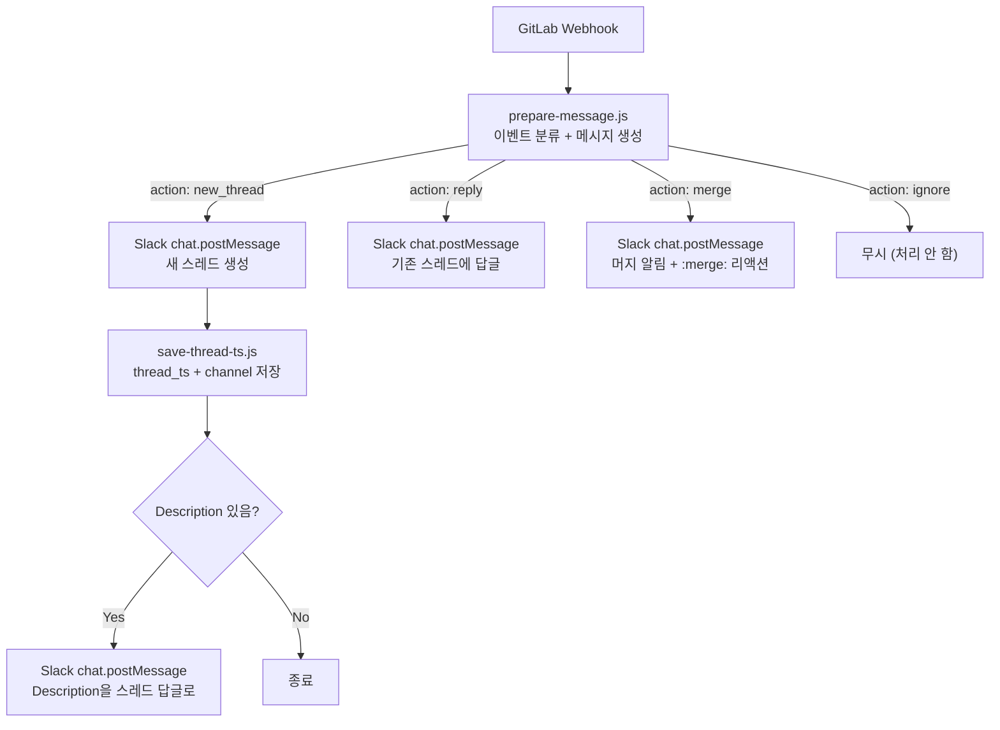

# 워크플로우 1: GitLab MR → Slack 알림

> GitLab Merge Request의 전체 라이프사이클을 하나의 Slack 스레드로 관리합니다.

## 개요

| 항목        | 내용                                      |
| ----------- | ----------------------------------------- |
| 트리거      | GitLab Webhook (MR / Pipeline / Note)     |
| 결과        | Slack 채널에 MR별 스레드 기반 실시간 알림 |
| Webhook URL | `/webhook/gitlab-mr-webhook`              |
| 관련 노드   | `prepare-message.js`, `save-thread-ts.js` |
| 템플릿      | `gitlab-mr-slack-notify.json`             |

---

## 동작 흐름



---

## 지원 이벤트

### Merge Request 이벤트 (`object_kind: merge_request`)

| action       | Slack 메시지                                    | 동작           |
| ------------ | ----------------------------------------------- | -------------- |
| `open`       | `@팀명 {제목} MR입니다.` + 작성자/브랜치/레이블 | 새 스레드 생성 |
| `update`     | 🔄 MR 업데이트 + 변경 디테일                    | 스레드 답글    |
| `merge`      | ✅ MR 머지 완료                                 | 스레드 답글    |
| `close`      | 🚫 MR 닫힘                                      | 스레드 답글    |
| `reopen`     | ♻️ MR 재오픈                                    | 스레드 답글    |
| `approved`   | 👍 MR 승인                                      | 스레드 답글    |
| `unapproved` | 👎 MR 승인 취소                                 | 스레드 답글    |

### Pipeline 이벤트 (`object_kind: pipeline`)

| status     | Slack 메시지             |
| ---------- | ------------------------ |
| `success`  | ✅ 파이프라인 성공 (N분) |
| `failed`   | ❌ 파이프라인 실패       |
| `canceled` | 🚫 파이프라인 취소       |

MR이 연결된 파이프라인만 처리하며, `thread_ts`가 없는 MR은 무시합니다.

### 코멘트 이벤트 (`object_kind: note`)

MR에 달린 코멘트만 처리합니다.

```
💬 *작성자명* 코멘트
(Markdown → mrkdwn 변환된 미리보기, 최대 200자)
```

---

## 핵심 구현

### 1. 스레드 관리: `staticData`

n8n의 `$getWorkflowStaticData('global')`를 사용하여 MR별 스레드를 추적합니다.

```javascript
// save-thread-ts.js
const staticData = $getWorkflowStaticData('global')

// 저장: MR iid → Slack thread_ts 매핑
staticData[`mr_${iid}`] = response.ts
staticData[`mr_${iid}_channel`] = channelId

// 조회: 이후 이벤트에서 thread_ts를 찾아 답글
const threadTs = staticData[`mr_${mrKey}`]
if (!threadTs) return [{ json: { action: 'ignore' } }]
```

- 별도 DB 없이 워크플로우 실행 간 상태를 유지
- `thread_ts`가 없는 MR은 자동으로 무시 (워크플로우 시작 전에 생성된 MR)

### 2. 채널 라우팅: 레이블 기반

```javascript
function getChannel(labels) {
  const names = labels.map((l) => l.title.toLowerCase())
  return names.some((n) => ['ask', 'show'].includes(n))
    ? CHANNEL_DEFAULT // 팀 공유 채널 (리뷰/공유)
    : CHANNEL_SHIP // 배포 채널 (일반 MR)
}
```

- `ask`, `show` 레이블 → 팀 공유 채널 (리뷰 요청, 공유 목적)
- 그 외 → 배포 채널 (일반 작업 MR)
- 채널 정보는 `staticData`에 함께 저장되어 이후 이벤트에서도 동일 채널 사용

### 3. Markdown → Slack mrkdwn 변환

GitLab MR Description을 Slack 형식으로 변환합니다.

```javascript
function mdToMrkdwn(md) {
  return md
    .replace(/<!--[\s\S]*?-->/g, '') // HTML 주석 제거
    .replace(/^#{1,3}\s+(.+)$/gm, '*$1*') // 헤딩 → 볼드
    .replace(/\*\*(.+?)\*\*/g, '*$1*') // bold
    .replace(/~~(.+?)~~/g, '~$1~') // strike
    .replace(/\[([^\]]+)\]\(([^)]+)\)/g, '<$2|$1>') // link
    .replace(/- \[x\]/gi, '☑') // checkbox
    .replace(/- \[ \]/g, '☐')
}
```

### 4. MR 업데이트 상세 정보

`update` 이벤트 시 `body.changes` 객체에서 변경 내용을 추출합니다.

| 감지 항목          | 표시 예시                     |
| ------------------ | ----------------------------- |
| 제목 변경          | `제목: 이전 제목 → 새 제목`   |
| 설명 변경          | `설명 변경`                   |
| 대상 브랜치 변경   | `대상 브랜치: develop → main` |
| 레이블 변경        | `레이블: WIP → Ready`         |
| 담당자/리뷰어 변경 | `담당자: 홍길동`              |
| 새 커밋            | `커밋: feat: add login`       |

---

## GitLab Webhook 설정

1. GitLab 프로젝트 → **Settings** → **Webhooks**
2. URL: `https://<n8n-host>/webhook/gitlab-mr-webhook`
3. Trigger:
   - **Merge request events** ✅
   - **Pipeline events** ✅
   - **Comments** ✅ (코멘트 알림이 필요한 경우)

---

## 환경변수

| 변수                 | 설명                              | 예시                        |
| -------------------- | --------------------------------- | --------------------------- |
| `SLACK_BOT_TOKEN`    | Slack Bot OAuth Token             | `xoxb-...`                  |
| `SLACK_CHANNEL`      | 팀 공유 채널 ID (ask/show 레이블) | `C04XXXXXXX`                |
| `SLACK_CHANNEL_SHIP` | 배포 채널 ID (일반 MR)            | `C05XXXXXXX`                |
| `SLACK_TEAM_MENTION` | 팀 멘션 텍스트                    | `@fe3` 또는 `<!subteam^ID>` |
