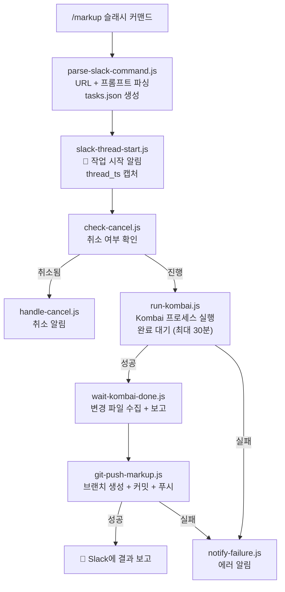

# 워크플로우 2: Figma → 마크업 자동 생성

> Slack 슬래시 커맨드로 Figma 디자인을 React 컴포넌트로 변환하고 GitLab에 자동 푸시합니다.

## 개요

| 항목        | 내용                                                                                                                                                                        |
| ----------- | --------------------------------------------------------------------------------------------------------------------------------------------------------------------------- |
| 트리거      | Slack 슬래시 커맨드 (`/markup`)                                                                                                                                             |
| 결과        | Kombai로 마크업 생성 → GitLab 브랜치에 자동 푸시                                                                                                                            |
| Webhook URL | `/webhook/markup-generate`                                                                                                                                                  |
| 관련 노드   | `parse-slack-command.js`, `slack-thread-start.js`, `check-cancel.js`, `run-kombai.js`, `wait-kombai-done.js`, `git-push-markup.js`, `handle-cancel.js`, `notify-failure.js` |
| 템플릿      | `figma-markup-generate.json`                                                                                                                                                |

---

## 동작 흐름



---

## 사용 방법

### 기본 사용

```
/markup https://www.figma.com/design/FILE_ID/NAME?node-id=NODE_ID
```

### 프롬프트 지정

```
/markup https://www.figma.com/design/xxx/yyy?node-id=123 React + TypeScript + Emotion으로 변환해줘
```

### 작업 취소

```
/cancel job-1234567890    # 특정 작업 취소
/cancel                   # 마지막 작업 취소
```

---

## 노드별 상세

### 1. parse-slack-command.js

Slack 슬래시 커맨드 페이로드에서 필요한 정보를 추출합니다.

**입력:** Slack Webhook body (`text`, `user_name`, `channel_id`)

**처리:**

1. 텍스트에서 Figma URL 추출 (정규식)
2. 나머지 텍스트를 프롬프트로 사용
3. Figma URL에서 `fileId`, `nodeId` 파싱
4. 유니크한 브랜치명 생성: `markup/auto-{날짜}-{시분}-{nodeId}`
5. `tasks.json` 파일 생성 → Kombai runner에 전달
6. `staticData`에 작업 등록 (취소 기능용)

**출력 데이터:**

```javascript
{
  jobId,          // 작업 ID
  figmaUrl,       // Figma URL
  prompt,         // 변환 프롬프트
  branchName,     // Git 브랜치명
  pocDir,         // Kombai 설치 경로
  projectRoot,    // 프로젝트 루트
  slackMessage,   // Ack 메시지
  // ...
}
```

### 2. slack-thread-start.js

Slack 채널에 부모 메시지를 전송하고 `thread_ts`를 캡처합니다.

이후 모든 진행 상태 알림이 이 스레드의 답글로 달립니다.

### 3. check-cancel.js / handle-cancel.js

`staticData`에서 작업 상태를 확인하여 취소 여부를 판단합니다.

```javascript
// check-cancel.js
const job = staticData[jobId]
const cancelled = job && job.status === 'cancelled'

// handle-cancel.js (별도 Webhook으로 /cancel 처리)
job.status = 'cancelled'
job.cancelledAt = new Date().toISOString()
```

### 4. run-kombai.js

Kombai 프로세스를 `child_process.spawn`으로 실행하고 완료를 대기합니다.

**핵심 포인트:**

- **Heartbeat 유지:** `await setTimeout(10000)`으로 10초마다 이벤트 루프를 yield
- **타임아웃:** 30분 (`TIMEOUT_MS = 1800000`)
- **진행 알림:** 5분마다 Slack 스레드에 경과 시간 알림
- **Kombai 환경변수:** `kombai-poc/.env`에서 별도 로드
- **자동 실행 모드:** `KOMBAI_EXIT_AFTER=true`, `KOMBAI_AUTO_RUN=true`

```javascript
const child = spawn('pnpm', ['dev'], {
  cwd: pocDir,
  env: { ...envVars, KOMBAI_EXIT_AFTER: 'true', KOMBAI_AUTO_RUN: 'true' },
})

while (!done) {
  await new Promise((r) => setTimeout(r, 10000)) // heartbeat 유지
}
```

### 5. wait-kombai-done.js

Kombai 완료 후 변경/추가된 파일을 수집합니다.

- `git diff --name-only`: 수정된 파일
- `git ls-files --others --exclude-standard`: 새로 생성된 파일
- `.tsx`, `.ts`, `.jsx`, `.css` 확장자만 수집
- 파일 내용, 크기, 경로 정보를 함께 전달
- Slack 스레드에 파일 목록 보고

### 6. git-push-markup.js

수집된 파일을 Git에 커밋하고 원격 브랜치로 푸시합니다.

**안전한 브랜치 관리:**

```
현재 브랜치 기억 → stash → 새 브랜치 생성 → stash pop
→ 파일 add → 커밋 → 푸시 → 원래 브랜치 복원
```

**커밋 메시지 형식:**

```
feat: auto-generated markup from Figma

Figma: https://www.figma.com/...
Prompt: React + TypeScript + Emotion
Files: src/components/Header.tsx, src/components/Header.css
```

### 7. notify-failure.js

실패 시 Slack 스레드에 에러 내용을 알립니다.

````
❌ 마크업 생성 실패

```error message```
````

---

## Slack 앱 설정

### 슬래시 커맨드 등록

1. [Slack API](https://api.slack.com/apps) → 앱 선택
2. **Slash Commands** → **Create New Command**
   - Command: `/markup`
   - Request URL: `https://<n8n-host>/webhook/markup-generate`
   - Description: Figma → React 마크업 자동 생성
3. 취소용 커맨드도 동일하게 등록
   - Command: `/cancel`
   - Request URL: `https://<n8n-host>/webhook/markup-generate` (같은 URL, text로 구분)

### 필요 권한

- `chat:write`: 메시지 전송
- `commands`: 슬래시 커맨드

---

## 환경변수

| 변수              | 설명                                             | 예시                   |
| ----------------- | ------------------------------------------------ | ---------------------- |
| `SLACK_BOT_TOKEN` | Slack Bot OAuth Token                            | `xoxb-...`             |
| `SLACK_CHANNEL`   | 기본 채널 ID                                     | `C04XXXXXXX`           |
| `KOMBAI_POC_DIR`  | Kombai PoC 디렉토리 (PROJECT_ROOT 기준 상대경로) | `./scripts/kombai-poc` |
| `PROJECT_ROOT`    | 프로젝트 루트 경로                               | `../..`                |
