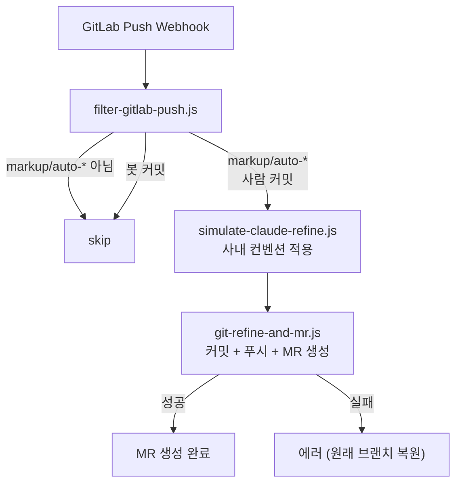
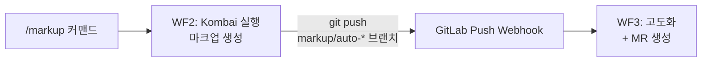
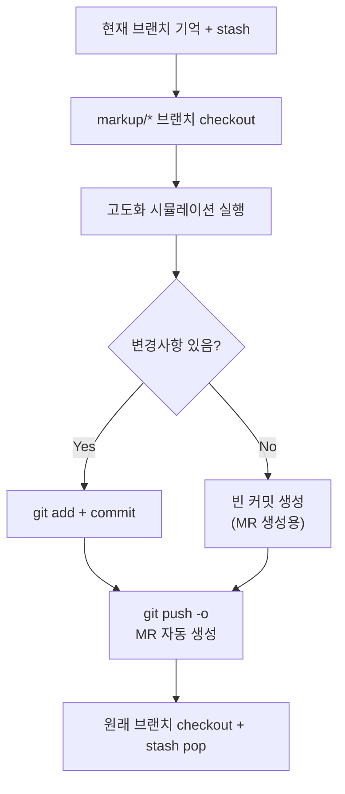

# 워크플로우 3: 마크업 고도화 → MR 자동 생성

> Kombai가 생성한 마크업을 AI 에이전트로 고도화하고 GitLab MR을 자동으로 생성합니다.

## 개요

| 항목        | 내용                                                                         |
| ----------- | ---------------------------------------------------------------------------- |
| 트리거      | GitLab Push Webhook (`markup/auto-*` 브랜치)                                 |
| 결과        | 코드 고도화 + GitLab MR 자동 생성                                            |
| Webhook URL | `/webhook/markup-refine`                                                     |
| 관련 노드   | `filter-gitlab-push.js`, `simulate-claude-refine.js`, `git-refine-and-mr.js` |
| 템플릿      | `figma-markup-refine.json`                                                   |

---

## 동작 흐름



---

## 워크플로우 2와의 연결

이 워크플로우는 **워크플로우 2 (Figma → 마크업 생성)**의 후속 파이프라인입니다.



---

## 노드별 상세

### 1. filter-gitlab-push.js

GitLab Push Webhook에서 처리 대상을 필터링합니다.

**필터 조건:**

| 조건                           | 결과                   |
| ------------------------------ | ---------------------- |
| `markup/auto-*` 브랜치가 아님  | `skip`                 |
| 마지막 커밋 author가 `n8n-bot` | `skip` (무한루프 방지) |
| 위 조건을 통과                 | `refine` (고도화 진행) |

**무한루프 방지가 중요한 이유:**

고도화 커밋이 push되면 다시 Push Webhook이 발생합니다. `n8n-bot` author를 체크하여 자기 자신의 커밋을 무시합니다.

**출력 데이터:**

```javascript
{
  action: 'refine',
  branchName,           // markup/auto-20260305-1430-123-456
  projectUrl,           // GitLab 프로젝트 URL
  projectPath,          // 프로젝트 경로 (namespace/name)
  userName,             // 푸시한 사용자
  lastCommitMessage,    // 마지막 커밋 메시지
  commitCount,          // 커밋 수
}
```

### 2. simulate-claude-refine.js

> 현재는 **시뮬레이션 모드**입니다. 실제 Claude CLI 에이전트 연동 전까지 임시 동작합니다.

**시뮬레이션 동작:**

1. `git diff`로 변경된 `.tsx`, `.ts`, `.jsx`, `.css` 파일 목록 추출
2. 각 파일 상단에 고도화 주석 추가:

```javascript
/**
 * [Auto-Refined by Claude Agent]
 * Original: Header.tsx
 * Refined at: 2026-03-05T14:00:00.000Z
 *
 * TODO: 실제 Claude CLI 에이전트 연동 시 이 시뮬레이션 제거
 */
```

3. 이미 주석이 있는 파일은 건너뜀 (중복 방지)

**향후 실제 구현 시:**

- Claude CLI 에이전트가 사내 코딩 컨벤션을 적용
- Emotion styled-components 패턴 변환
- 접근성(a11y) 개선
- 불필요한 인라인 스타일 제거

### 3. git-refine-and-mr.js

고도화된 코드를 커밋하고 GitLab MR을 자동 생성합니다.

**실행 순서:**



**MR 자동 생성 — `git push -o` 활용:**

```javascript
const pushCmd = [
  'git push',
  '-o merge_request.create', // MR 생성
  `-o merge_request.target=${targetBranch}`, // develop 브랜치 대상
  `-o merge_request.title="${mrTitle}"`, // 제목
  '-o merge_request.remove_source_branch', // 머지 후 소스 브랜치 삭제
  `origin ${branchName}`,
].join(' ')
```

GitLab의 `push option` 기능으로 별도 API 호출 없이 Push와 MR 생성을 동시에 처리합니다.

**에러 복구:**

에러 발생 시에도 원래 브랜치(`develop`)로 복원하고 stash를 복구합니다.

---

## GitLab Webhook 설정

1. GitLab 프로젝트 → **Settings** → **Webhooks**
2. URL: `https://<n8n-host>/webhook/markup-refine`
3. Trigger:
   - **Push events** ✅

---

## 환경변수

| 변수                   | 설명               | 예시      |
| ---------------------- | ------------------ | --------- |
| `PROJECT_ROOT`         | 프로젝트 루트 경로 | `../..`   |
| `GITLAB_TARGET_BRANCH` | MR 타겟 브랜치     | `develop` |
