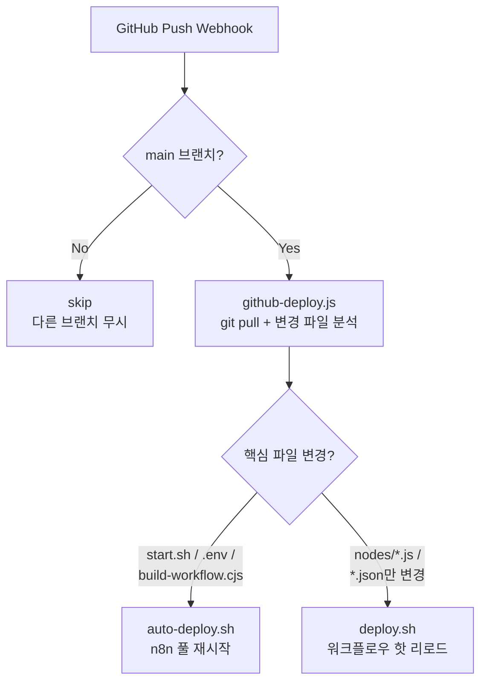

# 워크플로우 4: GitHub Push → 자동 배포

> n8n 워크플로우 코드를 GitHub에 푸시하면 자동으로 빌드 & 배포합니다.

## 개요

| 항목          | 내용                                          |
| ------------- | --------------------------------------------- |
| 트리거        | GitHub Push Webhook (`main` 브랜치)           |
| 결과          | 워크플로우 핫 리로드 또는 n8n 프로세스 재시작 |
| Webhook URL   | `/webhook/github-deploy`                      |
| 관련 노드     | `github-deploy.js`                            |
| 관련 스크립트 | `deploy.sh`, `auto-deploy.sh`                 |
| 템플릿        | `github-deploy.json`                          |

---

## 동작 흐름



---

## 배포 전략

### 핫 리로드 (deploy.sh)

노드 스크립트나 JSON 템플릿만 변경된 경우, n8n을 재시작하지 않고 워크플로우만 갱신합니다.

**동작 순서:**

1. `build-workflow.cjs` 실행 → `*-resolved.json` 생성
2. 각 워크플로우 파일의 MD5 해시를 비교하여 변경분만 import
3. import 전 `staticData` 백업 (SQLite에서 직접)
4. `n8n import:workflow`로 워크플로우 갱신
5. `staticData` 복원
6. 모든 워크플로우 활성화

**장점:**

- 다운타임 0
- `staticData` (MR thread_ts 등) 보존
- 웹훅 즉시 적용

### 풀 재시작 (auto-deploy.sh)

`start.sh`, `.env`, `build-workflow.cjs` 등 인프라 파일이 변경된 경우 n8n 프로세스 자체를 재시작합니다.

**동작 순서:**

1. 5678 포트 사용 프로세스 찾기 (`lsof`)
2. 프로세스 종료 (`kill` → `kill -9`)
3. `nohup bash start.sh`로 재시작

---

## github-deploy.js 상세

```javascript
// main 브랜치 push만 처리
if (branch !== 'main') {
  return [{ json: { action: 'skip' } }]
}

// 변경된 파일 확인
const changedFiles = execSync(`git diff --name-only HEAD~${commits.length} HEAD`).split('\n')

// 핵심 파일 변경 → 재시작 필요
const needsRestart = changedFiles.some((f) => f === 'start.sh' || f === '.env' || f === 'build-workflow.cjs')
```

**반환 데이터:**

| action       | 의미      | 상세                       |
| ------------ | --------- | -------------------------- |
| `skip`       | 무시      | main 브랜치가 아닌 경우    |
| `hot-reload` | 핫 리로드 | 워크플로우만 갱신          |
| `restart`    | 풀 재시작 | n8n 프로세스 재시작 예약   |
| `error`      | 오류      | git pull 또는 배포 중 에러 |

---

## 변경 감지 & staticData 보존

### MD5 해시 기반 변경 감지

```bash
NEW_HASH=$(md5 -q "$wf")
OLD_HASH=$(cat "$HASH_DIR/$WF_BASENAME.md5")

if [ "$NEW_HASH" = "$OLD_HASH" ]; then
  echo "⏭ 변경 없음"
  continue
fi
```

변경되지 않은 워크플로우는 import를 건너뛰어 불필요한 처리를 방지합니다.

### staticData 백업/복원

```bash
# import 전 백업
STATIC_DATA=$(sqlite3 database.sqlite \
  "SELECT staticData FROM workflow_entity WHERE id='$WF_ID';")

# import (staticData가 초기화됨)
n8n import:workflow --input="$wf"

# import 후 복원
sqlite3 database.sqlite \
  "UPDATE workflow_entity SET staticData='$STATIC_DATA' WHERE id='$WF_ID';"
```

`staticData`에는 MR별 `thread_ts` 등 중요한 런타임 데이터가 저장되어 있어, import 시 초기화되는 것을 방지합니다.

---

## GitHub Webhook 설정

1. GitHub 리포지토리 → **Settings** → **Webhooks**
2. Payload URL: `https://<n8n-host>/webhook/github-deploy`
3. Content type: `application/json`
4. Events: **Just the push event** ✅

---

## 배포 명령어 (수동)

```bash
# 핫 리로드 (워크플로우만 갱신)
./deploy.sh

# 풀 재시작 (n8n 프로세스 재시작)
./start.sh
```
